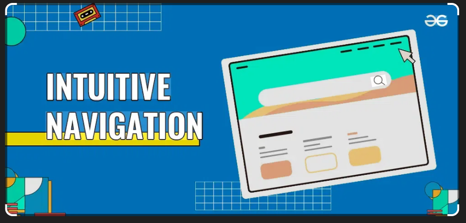

# Présentation du projet

Bienvenue sur la page de présentation de mon projet de documentation.

## Objectif

L'objectif de ce projet est de créer une documentation claire et facile à suivre pour les utilisateurs.

## Fonctionnalités principales

- Navigation simple et intuitive
- Pages organisées par thèmes
- Support pour le code, images et snippets
- Intégration AI tools (ChatGPT, Claude, etc.)

## Public cible

Cette documentation est destinée aux développeurs, débutants ou expérimentés, qui souhaitent apprendre à utiliser le projet.

## Contact

Pour toute question, vous pouvez contacter l'équipe support à l'adresse : [it@centrex.com](mailto:it@centrex.com)

##  Aperçu du projet

